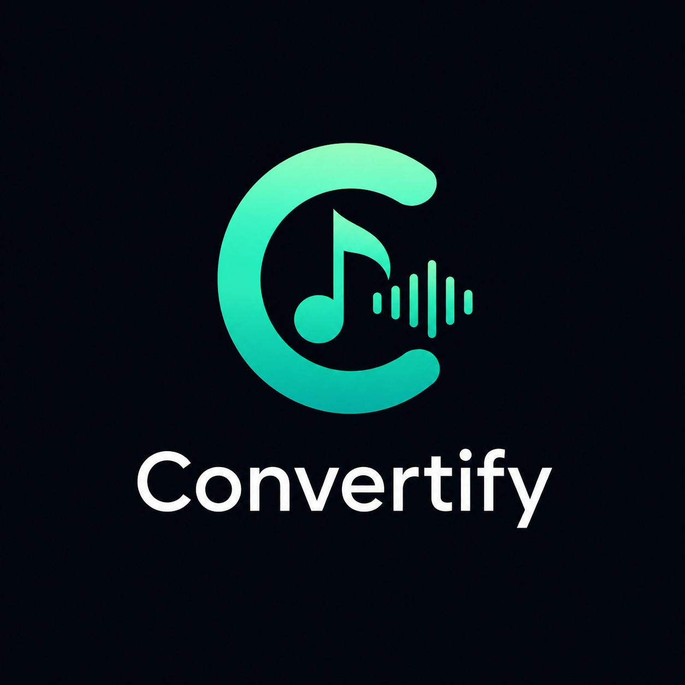

# Convertify — Video to MP3 Converter

---

Convertify is a mobile application that converts public video links from any platform into MP3 audio files. The Android app communicates with a Python FastAPI backend microservice that performs the audio extraction and MP3 conversion using `yt-dlp` and `FFmpeg`.

Once converted, the backend streams the MP3 file back to the Android app, which then saves it directly into the device's Music directory using Android's `DownloadManager`.

Convertify is a mobile application that converts public video links from any platform into MP3 audio files. The Android app communicates with a Python FastAPI backend microservice that performs the audio extraction and MP3 conversion using yt-dlp and FFmpeg. Once converted, the backend streams the MP3 file back to the Android app, which then saves it directly into the device's Music directory using Android's DownloadManager.

## Inspiration
Many MP3 converter websites are filled with advertisements, pop-ups, and malware. The goal of this project was to develop a clean, simple, and safe way to convert and download audio without dealing with malicious websites or unnecessary clutter.

## What it does
The app allows the user to:
- Paste a public video link from any platform.
- Convert the link into an MP3 file via the backend service
- Save the converted MP3 into the Music folder on the device
- Play MP3 files that already exist on their Android device

## How we built it
### Android (Frontend)
- Developed using Kotlin and Jetpack Compose
- Retrofit was used to send conversion requests to the backend API
- Android DownloadManager was used to store downloaded MP3 files directly into the Music directory

### Backend (FastAPI)
- A Python microservice (`main.py`) receives the video URL
- yt-dlp extracts the best available audio stream
- FFmpeg converts the audio stream into MP3 format
- The backend streams the converted MP3 file back to the Android client
- Temporary MP3 files are automatically deleted after download

## Challenges we ran into
The backend worked perfectly when running locally, but once deployed to Fly.io, file handling became problematic. Some platforms required cookie authentication for certain videos, and after cookie support was added, the backend stopped streaming files correctly. The MP3 file was being stored inside one container path while the server was trying to stream from a different directory. Debugging path mismatches, container storage behavior, and cookie authentication was the most challenging part of the project.

## Accomplishments that we’re proud of
- Built a fully functioning MVP that connects Android and FastAPI reliably
- Implemented secure MP3 conversion without using any external unsafe services
- Solved problems involving authenticated cookie handling and temporary storage cleanup
- Delivered an end-to-end working system with conversion, streaming, and file saving

## What we learned
- How to build a FastAPI microservice and deploy it in a cloud container environment
- How yt-dlp and FFmpeg work together to extract and convert audio
- How to debug deployment issues, log streaming errors, and work with containerized storage
- Practical experience connecting backend APIs with native Android apps

## What’s next for Convertify
- Add support for playlist and batch downloading
- Add an in-app audio player for downloaded files
- Add download history and file renaming features
- Improve UI/UX for a smoother conversion flow

## Contributors
| Name        | Role |
|-------------|------|
| Sehaj       | Android development, UI/UX, app logic, FastAPI + yt-dlp, DownloadManager integration |
| Aarshdeep   | Backend development, FastAPI + yt-dlp, UI/UX, integration, deployment, cookie authentication |

